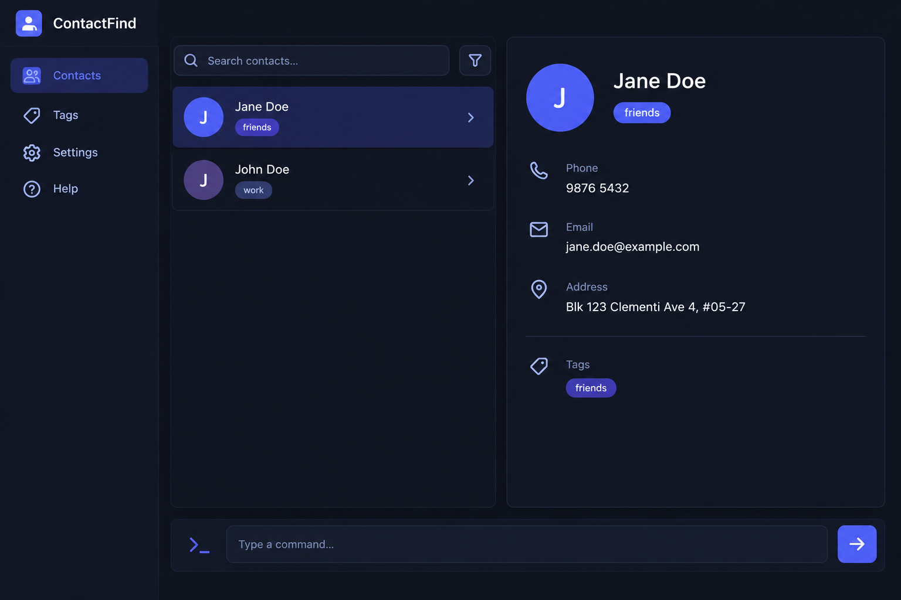

* This is **an address book for investment bankers**. 
  Example usages:
  * as a contacts book to store sensitive contacts
  * as an archive of contact information
  * as a tracker to know which contacts need follow-up
* The project is an address book for investment bankers to store and manage sensitive contacts.
  * It is **written in an object-oriented programming (OOP) style** and provides a **well-written** codebase.
* It is named `ContactFind`.

**Acknowledgement**

* This project is based on the AddressBook-Level3 project created by the [SE-EDU initiative](https://se-education.org).
