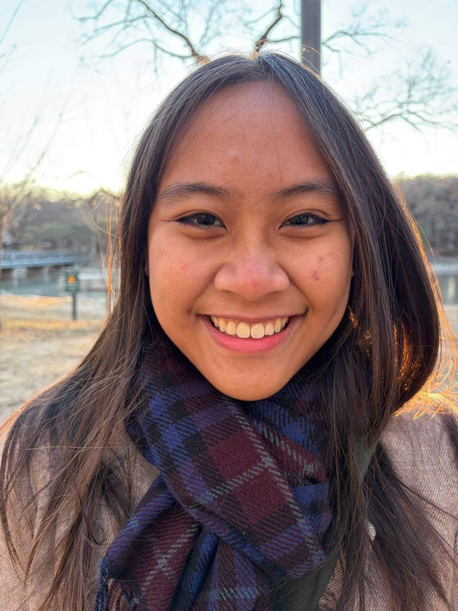
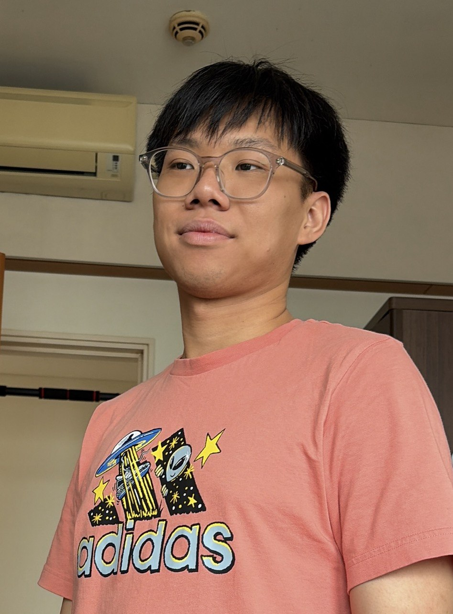
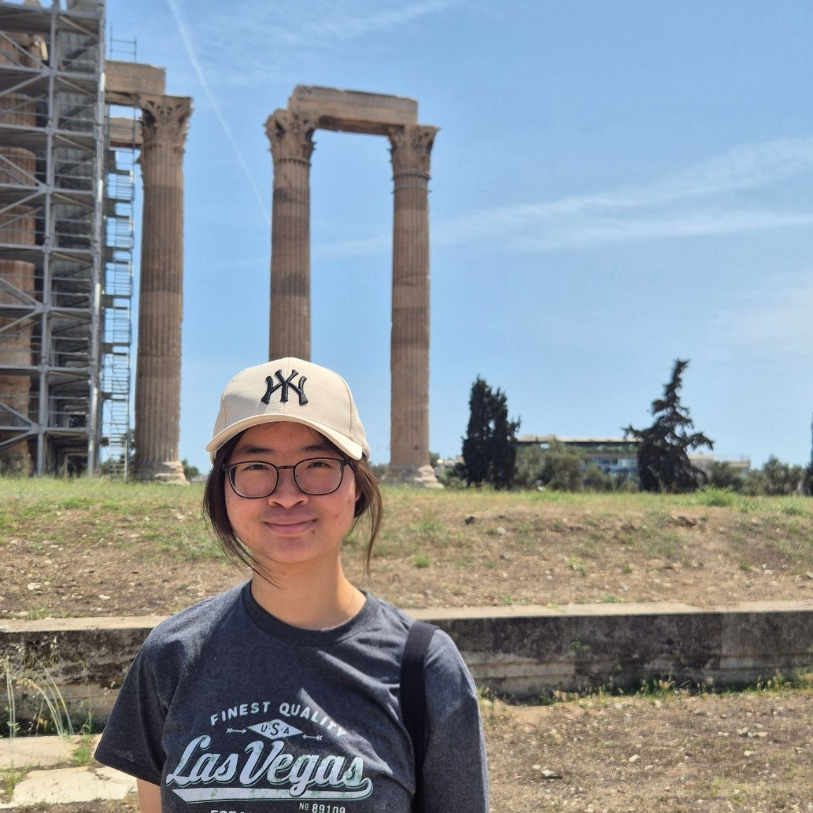
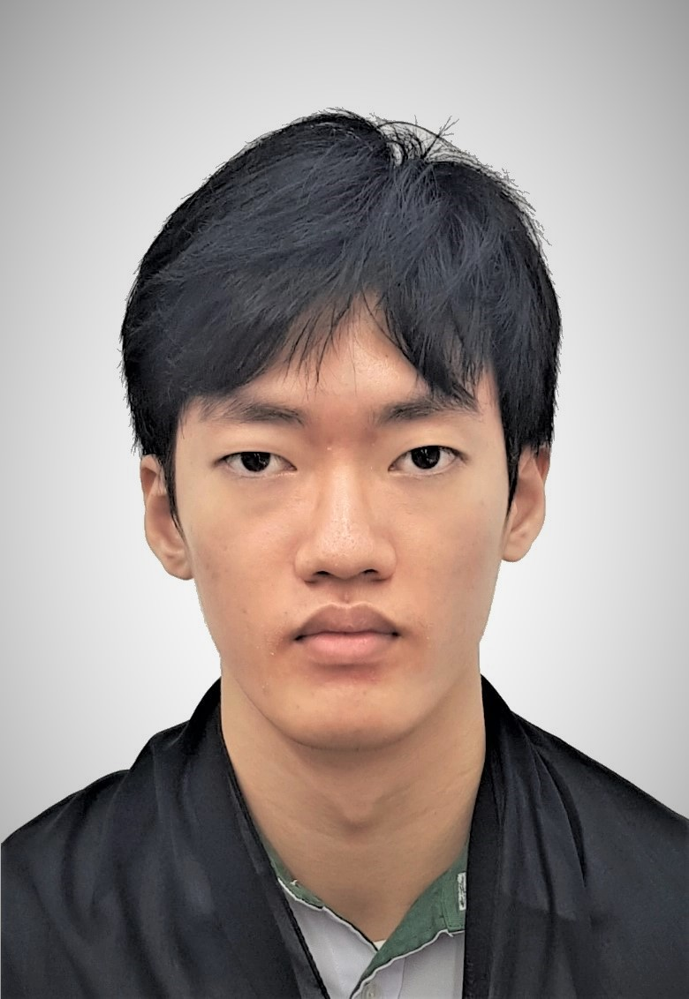

# About Us

We are a team based in the [School of Computing, National University of Singapore](http://www.comp.nus.edu.sg).

You can reach us at the email `seer[at]comp.nus.edu.sg`

## Project team

### John Doe

[[homepage](http://www.comp.nus.edu.sg/~damithch)]
[[github](https://github.com/johndoe)]
[[portfolio](team/johndoe.md)]

* Role: Project Advisor

### Jane Doe

[[github](http://github.com/johndoe)]
[[portfolio](team/johndoe.md)]

* Role: Team Lead
* Responsibilities: UI

### Keisha Anne Bulaon Robles

[[github](https://github.com/wellbakedquiche)] [[portfolio](team/johndoe.md)]

* Role: Developer
* Responsibilities: Data

### Terence Teo

[[github](http://github.com/of89p)]
[[portfolio](team/johndoe.md)]

### Claire Phay

[[github](http://github.com/clairep246)]

* Role: Developer
* Responsibilities: Dev Ops + Threading

### Wu Yonggang
 

[[github](https://github.com/Yonggang142)]

* Role: Developer
* Responsibilities: UI
